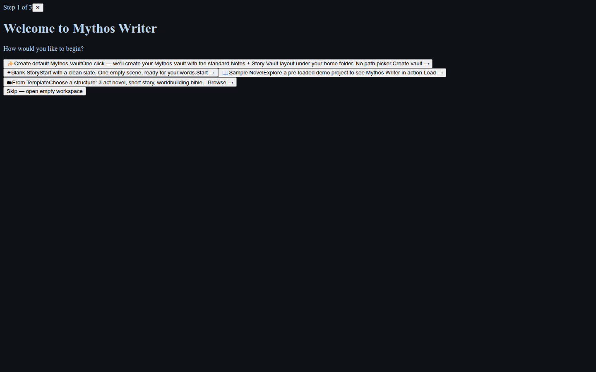
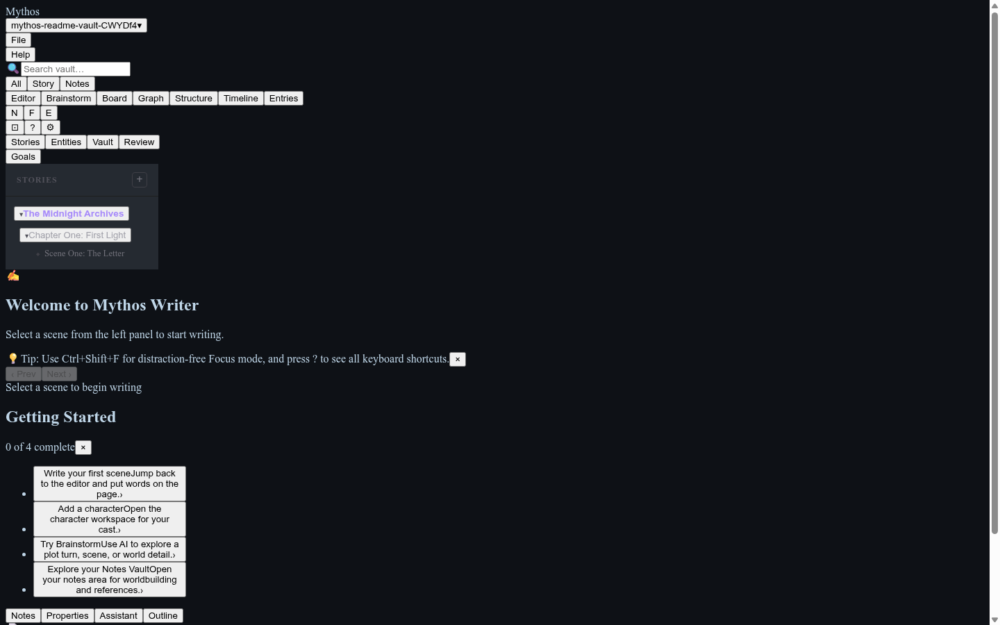
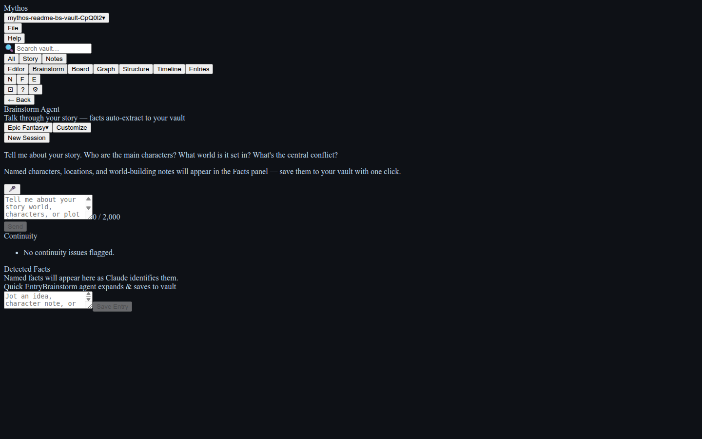
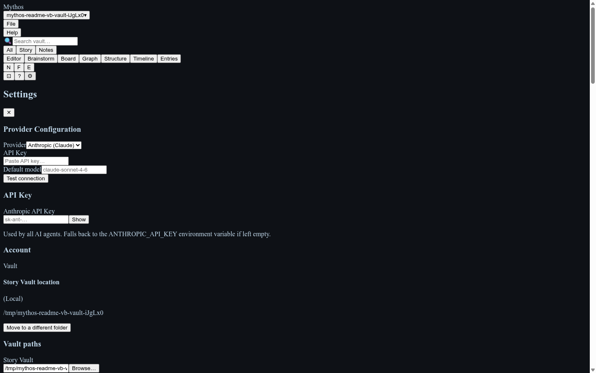
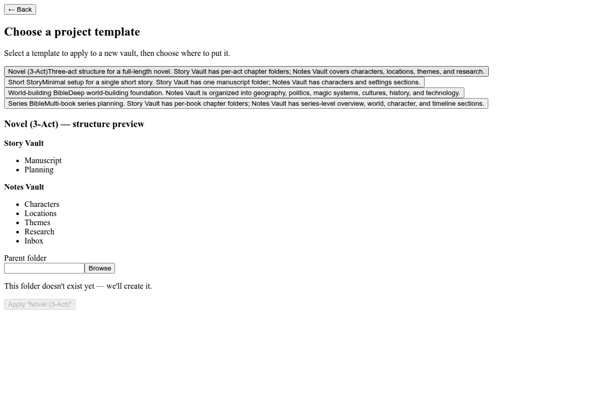
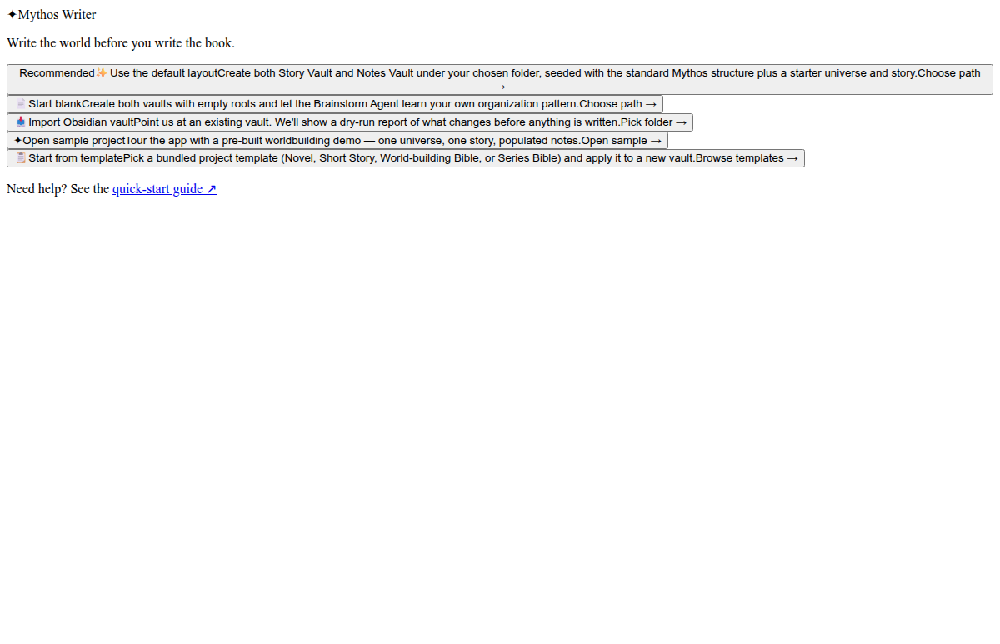

# Mythos Writer — v0.2.0-beta.1

> *A writing app, with an extra brain, to keep everything in mind so you don't have to.*

Your manuscript and your world live in separate apps. Every time you rename a character, you update it in two places. **Mythos Writer fixes that.**

One local Windows app: write your scenes in the Story Vault as plain Markdown files, and let the Brainstorm AI automatically fill your Notes Vault with the characters, locations, and factions it finds in your conversations. Map your plot on the **Scene Crafter** Kanban board. Follow the connections between your world's notes in the **Vault Graph**. Everything lives on your machine — no account, no subscription required.

**[Download Mythos Writer v0.2.0-beta.1 for Windows →](https://github.com/SkyyPlayz/Mythos-Writer/releases/latest)**

> **Beta notice:** v0.2.0 is a Windows-first beta. Core writing and worldbuilding features are stable; rough edges remain. File bugs on [GitHub Issues](https://github.com/SkyyPlayz/Mythos-Writer/issues) — every report helps.

## Screenshots

<table>
<tr>
  <td align="center" width="50%">
    <strong>First launch — onboarding wizard</strong><br/>
    
  </td>
  <td align="center" width="50%">
    <strong>Writing shell with Getting Started checklist</strong><br/>
    
  </td>
</tr>
<tr>
  <td align="center" width="50%">
    <strong>Brainstorm AI — conversational story development</strong><br/>
    
  </td>
  <td align="center" width="50%">
    <strong>Settings — vault sync status badge</strong><br/>
    
  </td>
</tr>
</table>

> **What's new in v0.2.0-beta.1:** Scene Crafter Kanban board for visual scene planning, Vault Graph for wiki-link mapping across your notes, and the Getting Started guided panel are live in this release. Brainstorm Panel drag-reorder, Open in Writing Panel, and custom template management (save / rename / duplicate / delete / import-export) landed in Wave 3.3.

## Installation

Download the latest release from the [Releases page](https://github.com/SkyyPlayz/Mythos-Writer/releases):

| Platform | File |
|----------|------|
| Windows  | `Mythos.Writer-<version>.exe` (NSIS installer) or `.zip` (portable) |
| Linux    | `Mythos-Writer-<version>.AppImage` |
| macOS    | Build from source (see [Local setup](#local-setup)) |

Run the installer or AppImage, then launch **Mythos Writer**.

## Quickstart (5 minutes)

1. **First launch** — the onboarding wizard appears. Pick a folder for your vault (or accept the default `~/Mythos`). Click **Create vault**. A **Getting Started** checklist appears in the right sidebar to guide you through the app's core features — dismiss it whenever you're ready.
2. **Create a story** — in the left rail, click **+** next to *Story Vault*, enter a title, press Enter.
3. **Add a chapter and scene** — expand your story, click **+** to add a chapter, then **+** inside the chapter to create your first scene.
4. **Write** — click the scene to open the editor. Start typing. Your work is saved automatically.
5. **Brainstorm with AI** — click **Brainstorm** in the top bar. Type a question or describe your story premise. Mythos Writer chats with Claude and automatically picks out characters, locations, and items from the conversation.

> **API key required for AI features.** Open **Settings** (⚙ icon in the top bar) → enter your [Anthropic API key](https://console.anthropic.com/). The key is stored locally — it never leaves your machine.

## Project Templates

Start a new project from a ready-made vault structure instead of a blank canvas. Mythos Writer ships with bundled templates — **Novel (3-Act)**, **Short Story**, **World-building Bible**, and **Series Bible** — that pre-populate your vault with a sensible chapter/scene hierarchy and notes folders for that story type.

Templates are available when you create a new story (click **+** next to *Story Vault* in the left rail and pick a template from the dialog).

## Key features

- **Story Vault** — organise your manuscript as Stories → Chapters → Scenes; each scene is a Markdown file you own
- **Notes Vault** — a free-form Markdown folder for world-building notes, research, and reference; its storage location (local or cloud-synced) is shown by the vault status badge in Settings
- **Project templates** — four bundled vault structures (Novel, Short Story, World-building Bible, Series Bible); save your own from any project and reuse them at onboarding
- **Rich scene editor** — TipTap-powered editor with WikiLinks (`[[Character Name]]`), draft states (In Progress / Review / Final), and word count
- **Writing modes** — Normal, Focus (distraction-free), and Edit (with inline AI suggestions); toggle with `Ctrl+Shift+N/F/E`
- **Brainstorm AI** — conversational story development; auto-extracts facts into vault entities; drag-reorder ideas in Custom sort mode; **Open in Writing Panel** sends any idea directly to the linked scene
- **Writing Assistant** — proactive inline suggestions as you write (Edit mode)
- **Entity browser** — characters, locations, factions, items, events, and concepts; wiki-link any entity from your scenes
- **Kanban board** — scene cards in a drag-and-drop board view
- **Graph view** — visual map of WikiLink connections across your vault
- **Export** — one-click EPUB and DOCX export (File → Export…)
- **Snapshot history** — automatic per-scene version snapshots; right-click the editor to restore
- **Auto-updater** — Stable and Beta release channels; updates install in the background
- **Vault status badge** — at-a-glance indicator in Settings showing whether your vault is stored locally or synced via a cloud provider (Google Drive, Dropbox, iCloud Drive, OneDrive)
- **Getting Started checklist** — a guided panel walks new users through writing their first scene, adding a character, trying Brainstorm, and exploring the Notes Vault; dismissible once you're ready to fly solo

## Documentation

| Guide | Contents |
|-------|----------|
| [User Guide](docs/user-guide.md) | Vault management, scene editor, Brainstorm AI, settings |
| [Entity System](docs/user-guide/entities.md) | Characters, locations, factions, items, events, concepts — wiki-links, connections, search |
| [Keyboard Shortcuts](docs/keyboard-shortcuts.md) | Full shortcut reference |
| [AI Providers Guide](#ai-providers) | Local models (Ollama, LM Studio), BYO provider, per-agent config |
| [Voice Guide](#voice-stt--tts) | STT/TTS setup, provider capabilities, backward compat |

## AI Providers

Mythos Writer ships with Anthropic Claude as the default AI provider. You can also run local models or use any OpenAI-compatible endpoint.

### Quick reference

| Provider | API key | Base URL required | Notes |
|----------|---------|-------------------|-------|
| **Anthropic** (default) | ✅ Required | — | Use your Anthropic API key at console.anthropic.com |
| **OpenAI / compatible** | ✅ Required | ✅ Required | `https://api.openai.com/v1` or your own endpoint |
| **Ollama** (local) | — | ✅ (auto-filled) | Default `http://127.0.0.1:11434/v1` |
| **LM Studio** (local) | — | ✅ (auto-filled) | Default `http://127.0.0.1:1234/v1` |
| **Custom** | Optional | ✅ Required | Any OpenAI-compatible endpoint |

### Using a local model (Ollama)

1. [Install Ollama](https://ollama.com) and pull a model: `ollama pull llama3`
2. Verify Ollama is running: `curl http://127.0.0.1:11434/v1/models`
3. In Mythos Writer: **Settings → AI Provider → Provider → Ollama (local)**
4. The Base URL is pre-filled as `http://127.0.0.1:11434/v1`
5. Enter the model name you pulled (e.g. `llama3`, `mistral`, `llama3-70b`)
6. Click **Test connection** — you should see ✓ Connection successful
7. Click **Save**

All three agents (Writing Assistant, Brainstorm, Archive) will use this model by default. Each agent can also be configured with a different provider — see [Per-agent configuration](#per-agent-configuration) below.

### Using LM Studio (local)

1. [Install LM Studio](https://lmstudio.ai) and start the local server (default port 1234)
2. Load a model in LM Studio's chat or server view
3. In Mythos Writer: **Settings → AI Provider → Provider → LM Studio (local)**
4. The Base URL is pre-filled as `http://127.0.0.1:1234/v1`
5. Enter the model name shown in LM Studio
6. Click **Test connection**, then **Save**

### BYO provider (OpenAI-compatible endpoint)

Any OpenAI Chat Completions-compatible API works, including:
- OpenAI (`https://api.openai.com/v1`)
- Groq (`https://api.groq.com/openai/v1`)
- Together AI, Perplexity, Mistral AI, and others

1. In Mythos Writer: **Settings → AI Provider → Provider → OpenAI** (or **Custom endpoint**)
2. Paste your API key
3. For custom/non-OpenAI endpoints, enter the Base URL
4. Enter the model name (e.g. `gpt-4o-mini`, `mixtral-8x7b-32768`)
5. Click **Test connection**, then **Save**

> **Security note:** When using a remote endpoint (non-localhost), your text is sent to that server. Only use endpoints you own or fully trust. Localhost endpoints (Ollama, LM Studio) never send data over the network.

### Voice

Mythos Writer supports local-first voice input, with optional cloud speech-to-text (STT) and text-to-speech (TTS) through the same provider settings used for AI text.

#### Enable voice

1. Open **Settings → Voice**.
2. Turn on **Enable voice input**.
3. Choose **Toggle** or **Push-to-talk** capture mode.
4. Pick a microphone, or leave **System default** selected.
5. For cloud STT or TTS, set the STT/TTS provider mode to cloud/auto and choose a **Voice Provider**.
6. Click **Save**.

Local STT/TTS paths keep using the configured local binaries and never require a cloud provider. When local mode is active, voice stays on your device.

#### Providers that support voice

| Provider | Voice support | Notes |
|----------|---------------|-------|
| **OpenAI** | ✅ STT + TTS | Uses OpenAI-compatible `/audio/transcriptions` and `/audio/speech` endpoints |
| **Custom OpenAI-compatible endpoint** | ✅ STT + TTS when a Base URL is set | Use for providers that implement OpenAI-compatible audio endpoints |
| **Anthropic** | — | Text AI only; does not provide STT/TTS endpoints |
| **Ollama / LM Studio** | Local text provider only by default | Local voice still works through the separate local STT/TTS settings |

#### What `capabilities` means

Provider configs can declare `capabilities` to tell Mythos Writer which non-text features are available:

```json
{
  "kind": "openai",
  "model": "gpt-4o-mini",
  "capabilities": { "transcribe": true, "speak": true }
}
```

`transcribe` means the provider can turn audio into text. `speak` means it can synthesize speech. The Voice Provider selector only lists providers that declare one of those capabilities, or known OpenAI-compatible voice providers.

### Backward compatibility

Older installs may still have `stt.cloudApiKey` or `tts.cloudApiKey` saved. Those keys continue to work as a fallback when no voice-capable provider is configured. New setups should prefer the unified provider configuration so text AI, STT, and TTS are managed from one place.

### Per-agent configuration

Each agent (Writing Assistant, Brainstorm, Archive) can use a different model or provider:

1. In **Settings → Agents**, expand any agent card
2. For the **global model** (same provider, different model): change the Model field — use the dropdown for Anthropic, or type a model name for other providers (e.g. `llama3-70b`)
3. For a **completely different provider**: toggle **Use a different provider for this agent**, then configure the provider, model, and credentials
4. Click **Test connection** to verify the per-agent configuration
5. **Save** — that agent will now use its own provider for all AI requests

## Custom Templates

Project templates give you a pre-built folder structure for your Story Vault and Notes Vault. Start a new project in seconds, or snapshot your own vault layout and reuse it across projects.

### Bundled templates

Mythos Writer ships with four ready-to-use templates:

| Template | Best for |
|----------|----------|
| **Novel (3-Act)** | Full-length novel with per-act chapter folders in Story Vault; Characters, Locations, Themes, and Research sections in Notes Vault |
| **Short Story** | Minimal layout for a single short story — one Manuscript folder and a compact Notes section |
| **World-building Bible** | World-first projects — Notes Vault organised by Geography, Politics & Power, Magic & Systems, Cultures & Peoples, and History |
| **Series Bible** | Multi-book series planning with per-book chapter folders plus Series Overview, Characters, World, and Timeline in Notes Vault |

### Starting from a template (onboarding)

When you first open Mythos Writer, click **From Template** on the welcome screen.

1. The **template gallery** opens, listing all four bundled templates. Any templates you have previously saved appear below them with a **Saved** badge.
2. Click a template card to select it. A **structure preview** panel shows the top-level folders that will be created in your Story Vault and Notes Vault. Click **Use this template →** to continue.
3. Enter a story title and set a **save location**. Mythos Writer will create a `[Story title]/` folder there, with `Story Vault/` and `Notes Vault/` inside it.
4. Click **Create Story →** to scaffold the vault and open the app.

> Each template includes starter note files inside its folders (for example, `Chapter 1/Scene 1 — Opening Hook.md` in the Novel template), so your vault is never empty on first open.



### Saving your own template

Once you have a vault structure you like, snapshot it for reuse:

1. Open **File → Save as Template…** from the menu bar.
2. Enter a name for the template and click **Save**.

The template is stored immediately and appears in the gallery the next time you start a project from a template.

**What gets captured:**
- The **folder tree** of both your Story Vault and Notes Vault, to any depth
- Folder names only — **no scene text, note content, or settings are included**

Templates are stored as JSON files in Mythos Writer's application data folder:

| Platform | Path |
|----------|------|
| Windows | `%AppData%\Mythos Writer\templates\` |
| macOS | `~/Library/Application Support/Mythos Writer/templates/` |
| Linux | `~/.config/Mythos Writer/templates/` |



### Managing your saved templates

From **Settings → Templates** you can rename, duplicate, or delete any template you have saved. Bundled templates cannot be deleted.

- **Rename** — edit the template name in place
- **Duplicate** — copy a template as a starting point for a variant
- **Delete** — remove a saved template permanently

<!-- screenshot: docs/screenshots/template-management-panel.png — Settings → Templates panel with rename / delete / duplicate controls -->

### Import and export

Share templates between machines or with other writers using the `.mythostemplate` file format.

- **Export:** **File → Export Template…** → select a saved template → choose a save location. Produces a `.mythostemplate` file you can share freely.
- **Import:** **File → Import Template…** → select a `.mythostemplate` file. The template is added to your gallery with a **Saved** badge and is available immediately.
- **Drag-and-drop import:** drag a `.mythostemplate` file directly onto the app window to import it without opening the file picker.

<!-- screenshot: docs/screenshots/template-import-export.png — import flow showing a .mythostemplate file being selected -->

---

## Brainstorm Panel

Click **Brainstorm** in the top navigation bar to open the AI brainstorm panel.

### Sort modes

Use the **Sort** dropdown (top-right of the panel) to change how brainstorm ideas are ordered:

| Mode | Behaviour |
|------|-----------|
| **Latest** | Newest ideas first (default) |
| **Oldest** | Oldest ideas first |
| **Custom** | Manual order — drag or use the keyboard to reorder |

### Drag-reorder ideas

Switch to **Custom** sort to unlock drag handles on every idea card.

1. Hover over a card — the drag handle (⠿) appears on the left.
2. Click and drag to a new position.
3. The new order is saved automatically.

**Keyboard shortcut:** focus a card and press **Alt+↑ / Alt+↓** to move it up or down without touching the mouse. Reordering is disabled while an AI response is streaming or while multi-select mode is active.

### Open in Writing Panel

Every brainstorm idea card has an **Open in writing panel** button (visible in the idea detail drawer). Clicking it:

1. **Linked scene** — if the card already has a linked scene, navigates directly to that scene in the editor and appends the idea as a scene note.
2. **No linked scene** — opens a scene picker; select a scene to link and navigate to it.
3. **No scenes in vault** — shows a toast notification prompting you to create a scene first.

This is the fastest way to carry a brainstorm insight directly into your manuscript.

---

## Contributing

See [CONTRIBUTING.md](CONTRIBUTING.md) for branch policy, required CI checks, and commit conventions.

---

## Tech Stack

| Layer         | Technology                                              |
| ------------- | ------------------------------------------------------- |
| Shell         | Electron 33, electron-vite, electron-builder            |
| Renderer      | React 18, Vite, TypeScript, TipTap                      |
| Main process  | Node.js 20, TypeScript, better-sqlite3, Anthropic SDK   |
| AI            | Anthropic Claude API (`@anthropic-ai/sdk`)              |
| Tooling       | ESLint, Prettier, Vitest, GitHub Actions                |

## Architecture

Mythos Writer is a **desktop Electron app**, not a web app. There is no HTTP server. The React renderer and Electron main process communicate exclusively over Electron IPC — all AI calls, vault file I/O, and SQLite access happen in the main process and are exposed to the renderer through typed IPC channels defined in `electron-main/src/ipc.ts`.

```
mythos-writer/
├── electron-main/        # Electron main process + IPC handlers
│   └── src/
│       ├── main.ts       # App lifecycle, BrowserWindow, IPC setup
│       ├── ipc.ts        # Channel definitions + typed handler contract
│       ├── vault.ts      # Vault file I/O (markdown, manifest)
│       ├── manifest.ts   # manifest.json schema + migration
│       ├── entities.ts   # Entity CRUD
│       ├── snapshots.ts  # Scene snapshot history
│       └── db.ts         # SQLite (suggestions, audit log, timeline)
├── frontend/             # React renderer (Vite)
│   └── src/
│       ├── main.tsx
│       ├── App.tsx
│       └── ...
├── out/                  # electron-vite build output (gitignored)
│   ├── main/             # Compiled main process
│   ├── preload/          # Compiled preload script
│   └── renderer/         # Compiled renderer (loaded by Electron in prod)
├── dist-electron/        # electron-builder packaged artifacts (gitignored)
├── electron.vite.config.ts
├── electron-builder.json
└── package.json          # Root workspace: frontend + electron-main
```

## Prerequisites

- Node.js 20+
- npm 10+
- An [Anthropic API key](https://console.anthropic.com/) — set in-app via Settings, or via `ANTHROPIC_API_KEY` env var
- Build tools for native modules: `python3`, `make`, `g++` (Linux/macOS usually have these; Windows needs Visual Studio Build Tools or `npm install --global windows-build-tools`)

## Local setup

```bash
# 1. Clone
git clone https://github.com/SkyyPlayz/Mythos-Writer.git
cd Mythos-Writer

# 2. Install all workspace dependencies
npm install
```

No `.env` file is needed for local dev. The API key is entered directly in the app's Settings panel (persisted to Electron's `userData`). Alternatively, export `ANTHROPIC_API_KEY` before starting.

## Development

```bash
npm run dev
```

Starts `electron-vite dev`: hot-reloads the React renderer in a live Electron window, watches the main process, and sets `VITE_DEV_SERVER_URL` so Electron loads the Vite dev server instead of the built renderer.

> **Native module note:** `npm run dev` automatically rebuilds `better-sqlite3` for Electron's Node ABI before launching. This takes a few seconds on the first run after `npm install`. If you run `npm test` after `npm run dev`, first restore the Node ABI with `npm run rebuild:node`.

## Production build and start

```bash
# 1. Install dependencies
npm install

# 2. Rebuild the native SQLite module for Electron
npm run rebuild:native

# 3. Compile main process + renderer to out/
npm run build:electron

# 4. Launch the compiled app (no packaging — fast local test of prod mode)
npm start

# 5. (Optional) Package as a distributable Windows zip
npm run build         # → dist-electron/Mythos Writer-<version>.zip

# 6. (Optional) Build a Windows NSIS installer
npm run build:installer  # → dist-electron/Mythos Writer-<version>.exe
```

`npm start` runs `electron .` against the files in `out/` (built by step 3). In production mode, `VITE_DEV_SERVER_URL` is not set, so Electron loads `out/renderer/index.html` directly — no HTTP server involved.

**Why the rebuild step?** `better-sqlite3` is a native Node.js addon. `npm install` compiles it for the system Node.js ABI. Electron embeds its own Node.js with a different ABI — without the rebuild step, the app crashes immediately on launch with a `NODE_MODULE_VERSION` error. `npm run rebuild:native` recompiles the addon for Electron's ABI. (Unit tests run under system Node.js; use `npm run rebuild:node` to switch back if needed.)

## Available scripts (run from repo root)

| Script                  | What it does                                                        |
| ----------------------- | ------------------------------------------------------------------- |
| `npm run dev`           | Rebuild native modules for Electron, then start hot-reload dev mode |
| `npm run rebuild:native`| Rebuild `better-sqlite3` for Electron's ABI (required before launch)|
| `npm run rebuild:node`  | Rebuild `better-sqlite3` for system Node.js ABI (for unit tests)    |
| `npm run build:electron`| Compile main + preload + renderer to `out/`                         |
| `npm start`             | Launch the already-built app from `out/` (prod mode)                |
| `npm run build`         | Compile + package as Windows zip to `dist-electron/`                |
| `npm run build:installer` | Compile + package as Windows NSIS installer                       |
| `npm run lint`          | ESLint across frontend                                              |
| `npm run test`          | Vitest across both packages                                         |
| `npm run typecheck`     | `tsc --noEmit` across both packages                                 |

## Troubleshooting

### App crashes with `NODE_MODULE_VERSION` error on launch

```
Error: The module '…/better-sqlite3/build/Release/better_sqlite3.node'
was compiled against a different Node.js version…
```

**Cause:** `better-sqlite3` was compiled for system Node.js but Electron uses a different internal ABI.  
**Fix:** Run `npm run rebuild:native`, then relaunch.

### Unit tests fail with `NODE_MODULE_VERSION` error

`npm run dev` rebuilds for Electron's ABI, which breaks unit tests running under system Node.js.  
**Fix:** Run `npm run rebuild:node` before `npm test`.

## Update Channels

Mythos Writer supports **Stable** (default) and **Beta** (opt-in) release channels. The app checks for updates on launch and prompts before installing.

### Opt into Beta

To receive beta releases before they ship to stable:

1. Open **Settings** in Mythos Writer
2. Look for **"Update Channel"** option
3. Select **"Beta"**
4. The app will check for updates and offer beta releases

Beta releases are labeled `v*.*.*-beta*` on the [Releases page](https://github.com/SkyyPlayz/Mythos-Writer/releases) and may contain experimental features.

### Opt back into Stable

1. Open **Settings**
2. Change **"Update Channel"** back to **"Stable"**
3. The next update will move you to the latest stable release

## Environment variables

| Variable            | Description                                                     |
| ------------------- | --------------------------------------------------------------- |
| `ANTHROPIC_API_KEY` | Anthropic API key — fallback if not set in app Settings         |

The API key is primarily stored via the in-app Settings panel (Electron `userData/app-settings.json`). The env var is a fallback for CI or headless use.

## CI

GitHub Actions runs on every push and pull request to `main`:

1. `npm ci` — install dependencies
2. Lint — ESLint on frontend
3. Type-check — `tsc --noEmit` on frontend and electron-main
4. Test — Vitest on electron-main and frontend
5. Build — `npm run build:electron` (compiles main + renderer to `out/`, no packaging)

## Releasing

The release workflow (`.github/workflows/release.yml`) runs automatically when a version tag is pushed and publishes to two release channels:

- **Stable channel** (default): triggered by `v*.*.*` tags (e.g., `v0.1.0`)
- **Beta channel** (opt-in): triggered by `v*.*.*-beta*` tags (e.g., `v0.1.0-beta1`)

### Publishing a release

```bash
# Stable release
git tag v0.1.0
git push --tags

# Beta release
git tag v0.1.0-beta1
git push --tags
```

GitHub Actions automatically:
1. Builds Windows NSIS installer and ZIP
2. Builds Linux AppImage, deb, and rpm packages
3. Generates release notes from PR titles and commit history
4. Creates and publishes the GitHub Release (auto-published; marked as pre-release if beta)

The release is immediately available via the auto-updater.

> Mac and Linux builds are stubbed (`if: false`) pending code signing setup in Phase 4.

### Windows Code Signing

The release workflow signs the Windows installer when the `WINDOWS_CERTIFICATE_BASE64` repository secret is present. Without the secret, the build still succeeds but produces an **unsigned** installer (Windows SmartScreen will warn users).

#### Certificate options

| Option | Use case | Notes |
|--------|----------|-------|
| **Self-signed** | Dev / CI verification | Free; SmartScreen will still warn end-users |
| **Standard OV certificate** | Public releases | ~$200–400/yr from DigiCert, Sectigo, etc. |
| **EV (Extended Validation)** | Production / SmartScreen reputation | ~$400–700/yr; immediately bypasses SmartScreen |

#### Setting up the secrets

**Generate a self-signed certificate (for CI testing):**

```powershell
# Run in PowerShell on Windows or in CI
$cert = New-SelfSignedCertificate `
  -Type CodeSigning `
  -Subject "CN=Mythos Writer Dev" `
  -KeyUsage DigitalSignature `
  -FriendlyName "Mythos Writer Dev" `
  -CertStoreLocation Cert:\CurrentUser\My `
  -TextExtension @("2.5.29.37={text}1.3.6.1.5.5.7.3.3", "2.5.29.19={text}")

$password = ConvertTo-SecureString -String "YOUR_PASSWORD" -Force -AsPlainText
Export-PfxCertificate -Cert $cert -FilePath certificate.pfx -Password $password

# Base64-encode for the GitHub secret
[Convert]::ToBase64String([IO.File]::ReadAllBytes("certificate.pfx")) | Set-Clipboard
```

**Add GitHub repository secrets** (`Settings → Secrets and variables → Actions → New repository secret`):

| Secret name | Value |
|-------------|-------|
| `WINDOWS_CERTIFICATE_BASE64` | Base64-encoded contents of `certificate.pfx` |
| `WINDOWS_CERTIFICATE_PASSWORD` | Password used when exporting the `.pfx` |

With these secrets in place, every tagged release build will produce a signed `.exe` installer.

To test the workflow without shipping a real release, push a pre-release tag and delete the resulting draft immediately:

```bash
git tag v0.0.0-test
git push origin v0.0.0-test
# after verifying the draft release is created, delete tag and release:
git push --delete origin v0.0.0-test
git tag -d v0.0.0-test
```
