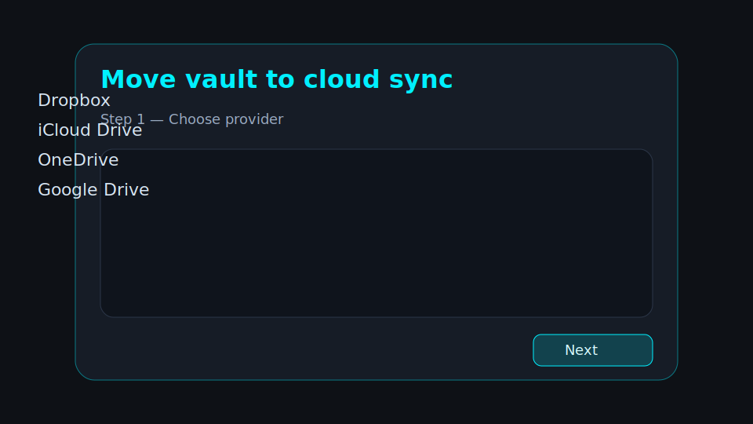
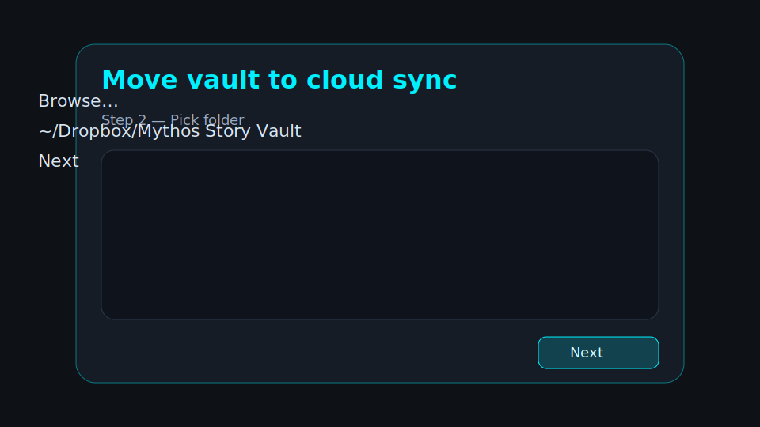
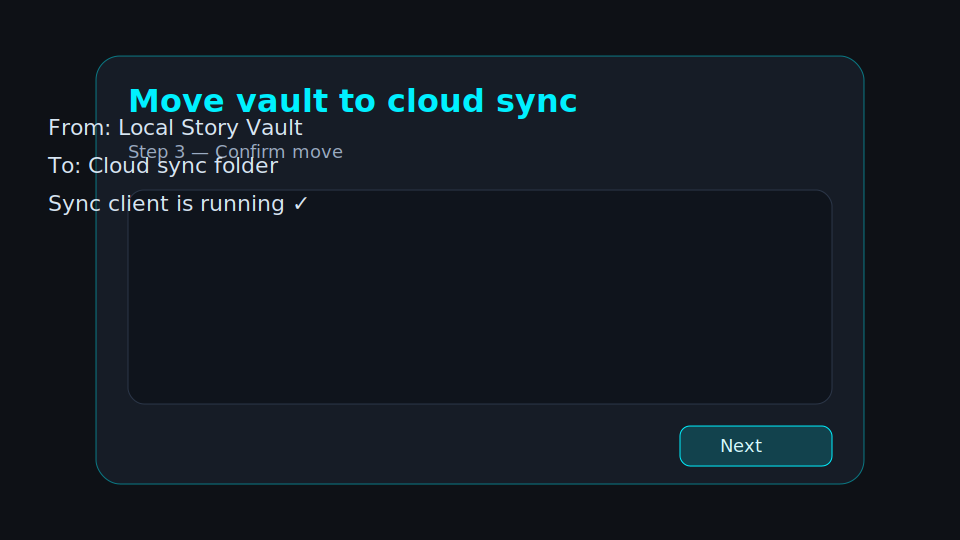
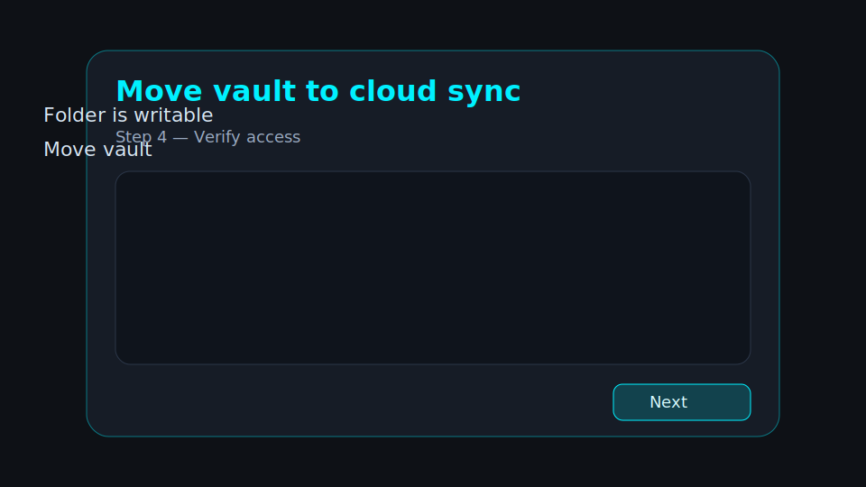
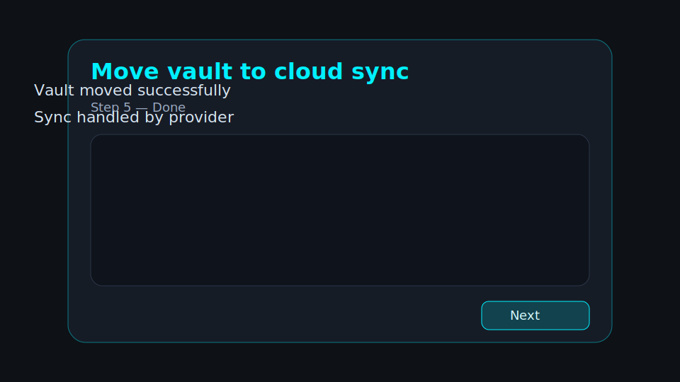

# Cloud Sync Setup and Troubleshooting

Mythos Writer can move the Story Vault into a folder managed by Dropbox, iCloud Drive, OneDrive, or Google Drive. The cloud provider performs sync; Mythos only moves the vault and verifies the folder is writable.

## Before you start

- Install and sign in to the cloud sync client on this computer.
- Let the provider create its local sync folder first.
- Close any other Mythos Writer window using this vault.
- Do not move vault files manually while the wizard is running.

## Setup guide

### 1. Choose a provider

Open **Settings → Vault paths → Cloud sync**, then click **Move vault to cloud sync…** and choose your provider.

### 2. Pick the synced folder

Click **Browse…** and select the folder already managed by your provider, for example `~/Dropbox/Mythos Story Vault`.

### 3. Confirm the move

Review the current and target paths. Check the confirmation box only after the sync client is running and the folder is visible locally.

### 4. Verify access and move

The wizard checks that Mythos can write to the target folder. If the check passes, click **Move vault**.

### 5. Finish

When the success screen appears, click **Done**. The Story Vault path in Settings updates to the new synced location.

## Conflict and lockfile warnings

- **Conflict file warning:** if Dropbox/iCloud/Syncthing-style conflict files are found, Mythos resolves them using last-modified-wins and archives older copies under `.mythos/.archive/`.
- **Concurrent session warning:** if a stale lockfile from another hostname is found, Mythos warns before continuing. Confirm no other device is actively editing the vault before you continue.

## Troubleshooting

### Vault not found

1. Open **Settings → Vault paths**.
2. Confirm **Story Vault** points at the synced folder shown by your provider.
3. If the folder moved or was renamed by the sync client, update the path and restart Mythos.

### Permission denied

1. Confirm the folder is not read-only and is not blocked by OS privacy controls.
2. On macOS, grant Mythos access to Files and Folders or Full Disk Access if your provider folder requires it.
3. Retry the wizard permission check after permissions are fixed.

### Sync client not detected

1. Start Dropbox, iCloud Drive, OneDrive, or Google Drive.
2. Wait until the provider reports that the selected folder is syncing.
3. Reopen the wizard and select the provider-managed local folder, not the provider website or a placeholder-only cloud file.
