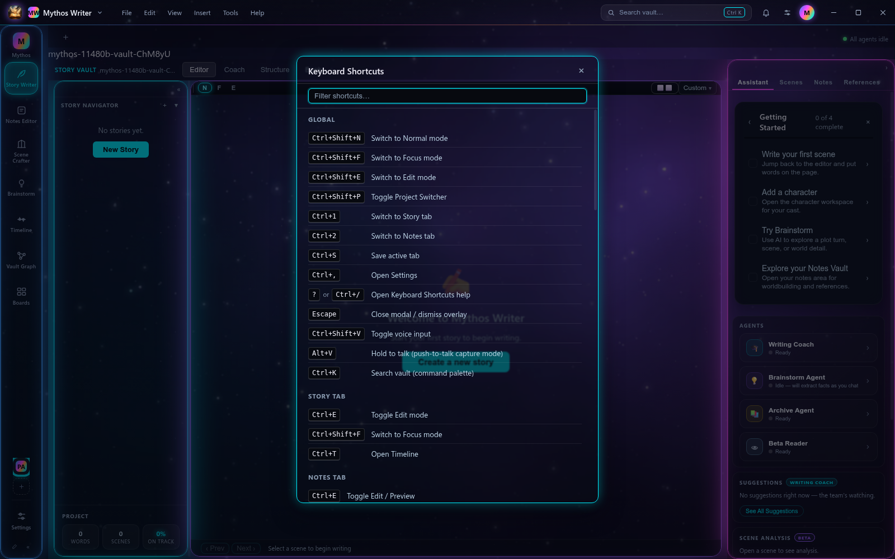

# SKY-11480 — Liquid Neon fidelity sweep: per-surface gap list

Parent: SKY-11439. Read-only analysis — no product code changed by this task.
Each gap below is meant to be dispatched as its own small PR (§3a, one surface per PR).

---

## What was measured, and against what

**Reference:** `companies/<cid>/owner-reports/2026-09-02-design-liquid-neon.dc.html`
(the newer of the two owner-report copies; the ticket names the 08-27 file, the
09-02 one supersedes it and is what `overlay-tier.css` already cites). Values are
read out of the Vue `{{ }}` data bindings and the inline `style=` strings, not
guessed from the rendered picture.

**Build under test:** `origin/main` @ `955846ca` **plus PR #1465 merged locally**.

> #1466 (Boards canvas) and #1467 (overlay tier) **are merged** — 20:21 and 20:17
> on 2026-09-08. **#1465 (Scene Crafter) is still OPEN.** The ticket asked for the
> post-fix state, so #1465 was merged into a throwaway worktree for this
> measurement. Every Scene Crafter finding below therefore survives #1465; none
> of them re-report something that PR already closes.

**Evidence:** two capture scripts, both added by this task under `e2e/fidelity/`:

| script | produces |
|---|---|
| `capture-sky11480-fidelity-sweep.mjs` | in-situ screenshots of Scene Crafter + Boards; the overlay-tier probe grid; `report.json` |
| `capture-sky11480-insitu.mjs` | real dialogs opened through ordinary UI; computed chrome for every named element; `report-insitu.json` |

Screenshots and both JSON reports: [`docs/screenshots/sky11480/`](../screenshots/sky11480/).

Two measurement caveats, stated so nobody mistakes an artifact for a gap:

- The **probe grid** mounts each catalogued class inside the live app root and reads
  `getComputedStyle`. Six rows came back `rgba(0,0,0,0)` / `0px` — `dtb-picker`,
  `dtb-close-popover`, `aeon-popover`, `aeon-context-menu`, `idea-context-menu`,
  `kanban-entry-picker-panel`, `migration-modal-card`. Their CSS lives in a Vite
  chunk that was never loaded because the component never mounted. Those rows are
  reported from the **CSS source**, and flagged as such.
- `.sc-board-row` and `.board-canvas__item` each resolved to the wrong first match
  (the `--new` variant; a folder tile). Not reported as gaps.

---

## Headline: the overlay tier's live value is wrong, and it is now the biggest single gap

`.ln-overlay-surface` resolves at shipped defaults to:

```
background:        rgba(13, 16, 28, 0.25)     ← 25% opaque
backdrop-filter:   blur(1.25px)               ← effectively no frost
```

The mockup specifies, on every floating surface (dc.html 66, 102, 119, 188, 285,
982, 1569, 1738 — the same lines `overlay-tier.css` quotes in its own header):

```
background:        rgba(15, 19, 33, 0.97)
backdrop-filter:   blur(24px)
```

**Root cause**, `frontend/src/theme/liquidNeonEngine.ts:359-361`:

```ts
const OVERLAY_TIER_MULT = 1.25;
const overlayGlassA = Math.min(96, S.glassA * OVERLAY_TIER_MULT);
const overlayBlur   = Math.min(40, S.blur   * OVERLAY_TIER_MULT);
```

Shipped defaults are `glassA: 20, blur: 1` (`LIQUID_NEON_V2_DEFAULTS`, line 106).
`20 × 1.25 = 25`. `1 × 1.25 = 1.25`. The static defaults in `tokens.css` (0.9 / 35px)
are *correct* — the JS bridge overwrites them on first paint.

The mockup ships the identical defaults (`glassA: 20, blur: 1`, dc.html script 134)
and its dialogs are still opaque, because **the mockup never derives dialog chrome
from the glass sliders** — it hardcodes `.97` / `24px`. There is a floor in the
design that we implemented as a multiplier.

Consequence: **every surface that adopted the tier is now more transparent than the
un-migrated ones it was supposed to match.** Measured in the same running app:

| surface | background | backdrop-filter |
|---|---|---|
| `.wc-popover` (frozen literal, **not** migrated) | `rgba(15,19,33,0.97)` | `blur(24px)` |
| `.ln-overlay-surface` (KeyboardShortcutsDialog, **migrated by #1467**) | `rgba(13,16,28,0.25)` | `blur(1.25px)` |



That screenshot is the proof: "Welcome to Mythos Writer", the "Create a new story"
button and the wallpaper's warm blob all read straight through the dialog body.
Compare [`insitu-wc-popover-help-menu.png`](../screenshots/sky11480/insitu-wc-popover-help-menu.png),
which is solid.

This is a legibility defect, not only a fidelity one, and it is **regressive** —
#1465, #1466 and #1467 each moved a surface onto the tier and each therefore made
that surface thinner. Fix this first; several gaps below disappear with it.

---

## Surface 1 — Scene Crafter

State: `origin/main` + PR #1465. Screenshots:
[`crafter-setup-full`](../screenshots/sky11480/crafter-setup-full.png) ·
[`crafter-ref-columns`](../screenshots/sky11480/crafter-ref-columns.png) ·
[`crafter-ref-card-detail`](../screenshots/sky11480/crafter-ref-card-detail.png) ·
[`crafter-boards-gallery`](../screenshots/sky11480/crafter-boards-gallery.png) ·
[`crafter-board-tab-open`](../screenshots/sky11480/crafter-board-tab-open.png) ·
[`crafter-canvas-head`](../screenshots/sky11480/crafter-canvas-head.png) ·
[`insitu-sc-pov-dropdown`](../screenshots/sky11480/insitu-sc-pov-dropdown.png) ·
[`insitu-sc-ref-picker`](../screenshots/sky11480/insitu-sc-ref-picker.png)

### SC-1 — the hairline tokens `--bwh` / `--bh` / `--glowH` are never emitted, so every hairline is 2× the mockup — **fix**

The mockup's engine stamps them (dc.html script 2443-2444):

```
--bwh:   max(.5, glowW / 2)                              → 0.5px at defaults
--bh:    hexA(c1, (.3 + .4 * I) / 2)                     → rgba(0,240,255,0.25)
--glowH: 0 0 round(glowR/2) -7px hexA(c1,(.18+.5*I)/2)   → 0 0 30px -7px @ 0.215
```

`liquidNeonEngine.ts` emits **none of the four** (`--bwh`, `--bh`, `--glowH`, `--grh`).
PR #1465 worked around it locally by deriving `--sc-bwh/--sc-bh/--sc-glow-h` from
`--b1 / --g1 / --gr`, but halving `--b1` (live alpha `1.000`) gives `0.5`, not the
mockup's `0.25`, and `max(0.5px, --bw/2)` gives `0.5px` only because `--bw` is `1px`.

Measured `.sc-panel`: `1px color(srgb 0 0.941 1 / 0.5)` — **2× the mockup's alpha**,
and the border width rounds up to a full pixel.

Same root cause still bites four files that read the raw tokens and silently get
their literal fallbacks, permanently off-theme:

- `ExportDialog.css:52` (`.export-scope-seg`)
- `timeline2/AxisView.css:48`
- `timeline2/panel/TimelineRightPanel.css:30`
- `components/BrainstormBoard/BrainstormBoard.css:365`

**Fix shape:** emit the four tokens from `liquidNeonEngine.ts` (2 lines, ported
verbatim from the mockup's engine), then delete #1465's `--sc-*` locals and let the
four files above resolve for real. One PR, five surfaces corrected.

### SC-2 — POV dropdown and the reference `+` picker inherit the 25%/1.25px tier — **fix (blocked on the headline)**

Measured: both `rgba(13,16,28,0.25)` / `blur(1.25px)`. #1465 moved them onto
`--glass-fill-overlay` on purpose and the structure is right; only the tier's value
is wrong. Closes automatically when the headline lands — **do not open a Scene
Crafter PR for this**.

### SC-3 — reference columns (CHARACTERS / LOCATIONS / ITEMS) — **already-correct**

Checked line by line against `crafterVaultCols` + `ckVault` (dc.html script 404-407,
3559-3576) and the column markup (markup 1518-1530):

| property | mockup | measured |
|---|---|---|
| card radius | `13px` | `13px` |
| card fill | `var(--glass2, rgba(21,26,45,.88))` | `rgba(21,26,45,0.5)` = live `--glass2` ✓ |
| card border | slot @ 38% | `color(srgb 0 0.941 1 / 0.38)` ✓ |
| hover | `translateY(-2px)`, border 75%, `0 0 20px -6px` @ 55% | ✓ (`SceneCrafterPage.css:1099`) |
| avatar band | `52px`, `linear-gradient(140deg, slot@30%, next@22%)` | ✓ measured gradient |
| column head | `10px/700/.13em`, slot colour, `text-shadow 0 0 12px` @45% | ✓ |
| column body | `14px` radius, `2px` pad, dashed 1px top rule | ✓ measured `repeating-linear-gradient` |

Slot assignment matches too (CHARACTERS→slot 1, LOCATIONS→slot 2, ITEMS→slot 4).
No action.

### SC-4 — boards gallery: meta line says "edited N ago" where the mockup says "N links" — **fix (trivial)**

Mockup `boardRows` (dc.html script 4079): `b.cards.length + ' cards · ' + b.links.length + ' links'`.
Ours (`SceneCrafterPage.tsx:987`): `N cards · edited <ago>`.

The link count is the one number that tells you whether a board has any structure;
"edited 3m ago" is already on the tab. Chrome is otherwise correct — `--gs2` fill,
`--b2` rim, `--g2` hover glow, `CANVAS` chip all match the mockup's inline styles.

### SC-5 — no back-to-Boards button on an open canvas — **out-of-scope (owner ruling supersedes the mockup)**

Mockup (markup 1385) puts a `‹ Boards` button left of the board name.
`SceneCrafterPage.tsx:710` deletes it deliberately under SKY-11069: the Scene Crafter
tab strip is the single navigation model and the pinned Setup tab is always one
click away. The `CANVAS` chip and the drag/resize/connect hint line both match.
Leave it.

### SC-6 — `+ New board` dashed gallery row has no mockup counterpart — **already-correct (app addition)**

SKY-11069 added it. It is not a fidelity gap; the mockup simply has no create
affordance. No action.

---

## Surface 2 — Notes Board / Boards canvas

State: `origin/main` (PR #1466 merged). Screenshots:
[`boards-canvas-full`](../screenshots/sky11480/boards-canvas-full.png) ·
[`boards-canvas-inside-folder`](../screenshots/sky11480/boards-canvas-inside-folder.png) ·
[`boards-item-tiles`](../screenshots/sky11480/boards-item-tiles.png) ·
[`boards-zoom-toolbar`](../screenshots/sky11480/boards-zoom-toolbar.png)

Reference is the mockup's `bdCanvasSt` (script 3401) and `bdCards` (script 3307-3340).

**Note on authority:** the ticket cites *BOARDS-SPEC v2* as the governing spec for
this surface. There is no such file in the repo (`grep -rl BOARDS-SPEC --include=*.md`
hits only `ENGINEERING_LESSONS.md`). Chrome gaps below are stated against the mockup.
Card-*anatomy* differences are filed separately as **needs-ruling** rather than as
fixes, because the Notes Board is a different product surface from the mockup's Idea
Board and I am not going to spec it unilaterally.

### BD-1 — the canvas is fully opaque; the mockup's is 42% and lets the wallpaper through — **fix**

| | mockup (`bdCanvasSt`) | measured `.board-canvas__root` |
|---|---|---|
| fill | `rgba(8,10,18,.42)` | `rgb(7,9,15)` — **opaque** |
| border | `1px solid rgba(255,255,255,.07)` | `1px rgba(0,240,255,0.31)` |
| radius | `16px` | `15px` |

The Boards view is the single largest rectangle in the app, and today it is a solid
black slab: the wallpaper stops at its edge. Visible in
[`boards-canvas-full`](../screenshots/sky11480/boards-canvas-full.png) — the starfield
runs along the top strip and the right sidebar, then dies at the canvas rim.

The mockup also uses a **neutral** hairline here, not a slot colour; the neon in that
region is carried by the cards, not the container.

### BD-2 — the dot grid neither tracks pan nor scales with zoom — **fix**

Mockup: `background-size: (20 * bdSc)px` and `background-position: bdPanX bdPanY` —
the grid moves and scales with the world, which is what makes panning legible.

Ours (`BoardCanvas.css`, added by #1466): fixed `26px 26px`, no `background-position`.
The PR comment claims this is "same as the mockup" — it is not; the mockup binds both
properties to pan/zoom state. Dot alpha also differs: `.07` mockup vs `.055` ours.

### BD-3 — every tile wears the selection rim at rest, so selection has no signal left — **fix**

Mockup `bdCards.st`:

```
border:      1px solid rgba(255,255,255,.1)          ← rest
             1px solid hexA(slot, .95)               ← selected / linking
box-shadow:  0 8px 22px rgba(3,5,12,.45)             ← rest (depth, no glow)
             0 0 0 1px slot@.45, 0 0 24px -6px slot@.65   ← selected
hover:       border slot@.6, 0 10px 26px rgba(3,5,12,.5), 0 0 18px -7px slot@.55
fill:        rgba(20,25,42,.9)  (rgba(15,19,32,.9) for columns)
```

Measured `.board-canvas__item`: `1px rgb(155,95,255)` — **full-alpha slot colour and a
glow at rest**, fill `rgba(21,26,45,0.5)`. So: rims are ~2× too strong, the fill is
40 points too thin, the rest state has a glow the mockup reserves for selection, and
the rest state is missing the mockup's `0 8px 22px` depth shadow entirely.

The functional cost is the point: the mockup spends the neon rim on *selected*, we
spend it on *exists*.

### BD-4 — zoom toolbar inherits the 25%/1.25px tier — **fix (blocked on the headline)**

Measured `.board-canvas__zoom-controls`: `rgba(13,16,28,0.25)` / `blur(1.25px)`.
Mockup's canvas pill: `rgba(15,19,33,.94)` + `--b2` rim. Structure from #1466 is right
(overlay tier + slot rim); only the tier value is wrong. Closes with the headline —
except the rim, which the mockup puts on **slot 2**, not slot 1: one-line retint via
`--ln-overlay-border`.

### BD-5 — breadcrumb bar is 20% opaque with a 1px blur — **fix**

Measured `.boards-tab-panel__breadcrumb`: `rgba(13,16,28,0.2)`, `blur(1px)`. It reads
`--bg-panel`, which `tokens.css:595` remaps to `--glass-fill` — the *panel* tier, which
the engine drives to 20% at defaults. Same family of bug as OT-5 below.

### BD-6 — tiles have no icon, no thumbnail, no preview text, no tag chips — **needs-ruling, not filed as a fix**

Mockup board tiles carry a 44px slot-filled icon tile plus up to 3 child chips; note
tiles carry a 134px gradient thumbnail band, a ≤170-char body preview and tag chips
(script 3325-3338). Ours render title + `"N boards, N cards"` and nothing else — see
[`boards-item-tiles`](../screenshots/sky11480/boards-item-tiles.png).

This is a content/feature difference, not a token difference, and it is exactly what
BOARDS-SPEC v2 would govern. **Needs the CEO to point at the spec (or rule) before
anyone builds it.**

---

## Surface 3 — Overlay tier (Settings, popups, dialogs)

Full enumeration. Every floating dialog / popover / menu surface in the app, with the
chrome it actually renders. Numbers from
[`report.json`](../screenshots/sky11480/report.json) and
[`report-insitu.json`](../screenshots/sky11480/report-insitu.json); pictures in
[`overlay-tier-probe-grid`](../screenshots/sky11480/overlay-tier-probe-grid.png) and
[`overlay-tier-probe-grid-2up`](../screenshots/sky11480/overlay-tier-probe-grid-2up.png).

Target recipe (mockup, and what `overlay-tier.css` documents):
`rgba(15,19,33,.97)` · `blur(24px)` · `var(--bw) solid var(--b1)` ·
`0 14px 40px rgba(3,5,12,.6), 0 0 22px -6px var(--g1)`.

### OT-1 — the tier itself: 25% fill, 1.25px blur — **fix, do this first**

See headline. Affects all 7 surfaces #1467 migrated (`ui/Dialog` + its 10 consumers,
`FocusModePrefsDialog`, `KeyboardShortcutsDialog`, `LayoutManagerDialog`,
`PageSetupPopover`, `TourModal`, `NoteTemplateDialog`) plus SC-2 and BD-4.

**Fix shape:** floor the overlay tier in `liquidNeonEngine.ts` rather than deriving it
— `max(0.90, glassA × 1.25 / 100)` and `max(24, blur × 1.25)`, still clamped at 96 / 40.
Guard-test it: the tier's computed alpha must not fall below 0.9 at *any* slider position.

> In-flight: SKY-11477 is adding `--ln-overlay-shadow` to `overlay-tier.css` for the
> Timeline cards. Different concern, no conflict, but sequence the two.

### OT-2 — `.ln-menu` (`components/ui/Menu.css`) is off the glass entirely — **fix, highest reach**

```
measured:  rgb(15,19,33)   blur: none   border: 1px rgba(255,255,255,0.15)
           box-shadow: rgba(3,5,12,0.55) 0 12px 48px       (--elev-2, depth only)
```

Flat opaque fill (`--bg-elevated: #0f1321`), a neutral white hairline, and no neon
anything. This is the shared popup primitive — **8 downstream surfaces** carry the
defect: `StoryNavigator`, `AppNavRail`, `IdeaContextMenu`, `StoryVaultPicker`,
`VaultBrowser/StoryContextMenu`, `VaultBrowser/ContextMenu`,
`SettingsPanel/VaultOverflowMenu`, `NotesVaultPicker` (plus `WindowChrome`).
One class, eight surfaces — best ratio on the board.

### OT-3 — `.ln-select-listbox` (`components/ui/DropdownSelect.css`) — **fix**

Identical numbers to OT-2, same `--bg-elevated` / `--border-default` / `--elev-2`
recipe. Second shared primitive.

### OT-4 — eight surfaces paint a hardcoded grey that is not in the palette — **fix**

Most of these read custom properties that **are defined nowhere in the codebase**, so
the literal fallback inside `var()` is what paints, permanently immune to the theme;
one just hardcodes a hex:

| surface | reads | actually paints |
|---|---|---|
| `GlobalRightSidebar .grs-add-panel-picker` | `--color-surface-raised` | `#2a2a2a` — neutral grey |
| `NoteViewer .note-fidelity-dialog` | `--bg-secondary` | `#181818` |
| `OutlinePlanningPanel .opl-link-picker` | *(no token at all)* | `#18181b` hardcoded |
| `LayoutPicker .layout-picker-dropdown` | `--color-surface-elevated` | `#1a1f2e` |
| `TimelinePicker .tlpicker__dropdown` | `--color-surface-elevated` | `#1e1e2e` |
| `GlobalSearchPanel .gsp-panel` | `--panel-bg` | `#1e1e2e` |
| `TagInput .tag-dropdown` | `--panel-bg` | `#1a1d2e` |
| `TagPane .tp-merge-dialog` | `--panel-bg` | `#1a1a2e` |

`--color-surface-raised`, `--color-surface-elevated`, `--panel-bg`, `--bg-secondary`
and `--surface-1` have **zero definitions** in `frontend/src`. Same class of defect as
SKY-11449's nine dead Boards tokens; add these five to whatever guard test that shipped.

`.grs-add-panel-picker` at `#2a2a2a` is the worst offender — a flat neutral grey panel
in a cyan/violet app.

### OT-5 — six dialogs render at 20% opacity with **no** backdrop blur at all — **fix (legibility)**

| surface | reads | measured |
|---|---|---|
| `SceneHistory .history-confirm-dialog` | `--bg-panel` | `rgba(13,16,28,0.2)`, blur `none` |
| `SplitEditorPane .spe-scene-popover` | `--bg-panel` | same |
| `ProjectSwitcher .project-switcher-dropdown` | `--bg-surface` | same |
| `BrainstormPage .bs-delete-confirm-dialog` | `--bg-surface` | same |
| `IdeaDetailDrawer .idd-discard-dialog` | `--bg-surface` | same |
| `IdeaDetailDrawer .idd-entity-picker` | `--bg-surface` | same |

Precise mechanism: `tokens.css:593-596` is

```css
@supports (backdrop-filter: blur(1px)) {
  :root { --bg-panel: var(--glass-fill); }
}
```

so on every platform we ship to, `--bg-panel` (and `--bg-surface` / `--surface` /
`--color-surface`, which chain to it) flips from the opaque fallback to
`--glass-fill` = `rgba(13,16,28,0.200)`. The token opts into glass; **the six elements
above never declare a `backdrop-filter` to go with it.** They get the transparency and
none of the frost.

That contract is fine for panels — a panel sits on the opaque app shell. A floating
dialog does not. **Worse than OT-1**, because here there is no blur at all: a
delete-confirmation you can read the underlying board straight through. Two of the six
are destructive-action confirmations.

### OT-6 — eleven surfaces are frozen at the mockup's literals — **fix (low priority; correct today)**

`.export-dialog`, `.nsp-pane-menu`, `.spe-pane-menu`, `.note-gear-menu`,
`.tlr-tpl-menu`, `.wtb-ctx-menu`, `.wtb-new-tab-menu`, `.wtb-overflow-menu`,
`.wc-popover`, `.ln-drafts-popover`, `.vb-vault-picker-dropdown`.

All measure `rgba(15,19,33,0.97)` + `blur(24px)` — i.e. they **look right**, because
they hardcode the mockup's numbers. They are dead to Appearance, and once OT-1 lands
they become the odd ones out. Migrate to `.ln-overlay-surface` *after* OT-1, never before.

Two sub-notes: `.vb-vault-picker-dropdown` has a neutral `rgba(255,255,255,0.1)` rim
and no glow (it should be slot-1); `.tlr-tpl-menu` is correctly retinted to slot 2.

### OT-7 — seven surfaces are half-migrated: right fill family, neutral rim, no glow — **fix**

They use `--glass-fill-fallback` (the *opaque* no-backdrop-filter path) plus a
`--glass-border` / `--border-subtle` neutral hairline:

| surface | measured | source |
|---|---|---|
| `DesktopShell .app-menu-dropdown` | `rgba(13,16,28,0.25)`, `blur(16px) saturate(1.6)`, rim `rgba(255,255,255,0.07)` | in-situ |
| `DesktopShell .cross-tab-link-modal__card` | `rgb(13,16,28)`, no blur, rim `rgba(255,255,255,0.07)` | probe |
| `VaultBrowser .vb-context-menu` | `rgb(13,16,28)`, no blur, rim `rgba(255,255,255,0.07)` | probe |
| `DockedTabBar .dtb-picker` | `--glass-fill-fallback` + `--glass-border` | CSS (`DockedTabBar.css:239`) |
| `DockedTabBar .dtb-close-popover` | same | CSS (`:124`) |
| `AeonLaneView .aeon-popover` | `--glass-fill-fallback`, `blur(12px)`, `--border-subtle` | CSS (`:341`) |
| `AeonLaneView .aeon-context-menu` | same | CSS (`:459`) |

Each is one `class` add plus deleting three declarations, once OT-1 is right.

### OT-8 — remaining one-offs — **fix**

| surface | measured | note |
|---|---|---|
| `LeftRail .lr-panel-picker` | `rgb(15,19,33)`, rim `rgba(255,255,255,0.06)` | `--bg-elevated`, flat |
| `TemplatePicker .tp-modal` | `rgb(15,19,33)`, **no box-shadow at all** | a modal with no elevation |
| `IconPicker .icon-picker-modal` | `rgb(13,16,28)`, **no box-shadow** | same |
| `InconsistencyCard .ic-consent-modal` | `rgb(15,19,33)` | flat |
| `SceneGrid .context-menu` | `rgb(15,19,33)` | flat |
| `PresetSelector .preset-selector-dropdown` | `rgb(15,19,33)` | flat |
| `EntityBrowser .entity-dialog` / `.entity-type-picker` | `rgb(13,16,28)` | flat |
| `DesktopShell .prompt-modal` | `rgb(13,16,28)` | flat |
| `SettingsPanel .lg-popover` | `rgb(8,10,18)` | `--bg-inset` — the **wells/inputs** token on a popover |
| `VaultGraphView .vgv-legend-popover` | `rgb(8,10,18)` | `--bg-inset`, same mistake |
| `WikiLinkPicker .wiki-link-picker` | `rgb(13,16,28)`, rim `rgba(0,229,255,0.3)` | rim is a **hardcoded** near-cyan, not `--b1` |
| `EntityMention .entity-mention-picker` | `rgb(13,16,28)`, rim `rgba(0,240,255,0.3)` | hardcoded slot-1 literal |
| `ManuscriptView .msv-title-menu-popover` | `rgba(18,22,32,0.97)`, no blur | off-palette fill |
| `MythosMigration .mythos-migration-modal` | `rgba(13,16,28,0.96)`, no blur, `--b2` rim + glow | closest of the lot; needs blur only |
| `AgentSessionPicker .asp-dropdown` | `rgba(13,16,28,0.96)`, `blur(18px) saturate(1.5)`, slot-3 rim | **nearest to correct** in the whole app |
| `KanbanBoard .kanban-entry-picker-panel` | `--bg-bar` → `--bg-canvas` | CSS-source; the *canvas* token on a popover |
| `MigrationBanner .migration-modal-card` | `--surface-1` (undefined) → `#1a1d24` | CSS-source; add to OT-4's list |
| `BrainstormCard .idea-context-menu` | `--bg-surface` | CSS-source; belongs to OT-5 |

### Already-correct on this surface

`components/ui/Dialog.tsx` (`.ln-dialog.ln-overlay-surface`) is structurally right and
carries its 10 consumers with it — `ArchiveConfirmDialog`, `SyncConflictModal`,
`CalendarEditorModal`, `ExactTimeModal`, `AccountModal`, `AddVaultDialog`,
`NotesVaultPicker`, `VaultOverflowMenu`, `VaultLinkingColumns`, `VaultsFolderSection`.
They inherit OT-1 and nothing else. `.tlr-tpl-menu`'s slot-2 retint is correct.

---

## Suggested dispatch order

| # | gap | why here |
|---|---|---|
| 1 | **OT-1** overlay-tier floor (`liquidNeonEngine.ts`) | closes SC-2, BD-4 and unblocks OT-6/OT-7; regressive today |
| 2 | **OT-5** panel-tier tokens on floating dialogs | legibility, includes two destructive confirmations |
| 3 | **OT-2 + OT-3** the two shared primitives | one class each, ~10 surfaces |
| 4 | **SC-1** emit `--bwh/--bh/--glowH/--grh` | 2 engine lines, corrects 5 surfaces, retires #1465's workaround |
| 5 | **OT-4** the five undefined tokens | same guard test as SKY-11449 |
| 6 | **BD-1 + BD-2 + BD-3** Boards canvas + tiles | one Boards PR |
| 7 | **OT-7 + OT-8** one-offs | after 1, batched by file |
| 8 | **OT-6** frozen literals | last, or they churn twice |
| 9 | **SC-4** boards-gallery meta line | trivial, ride along with any Scene Crafter PR |

Not fixes: **SC-3**, **SC-5**, **SC-6**, `ui/Dialog` and its consumers.
Needs a ruling before anyone builds: **BD-6**.
