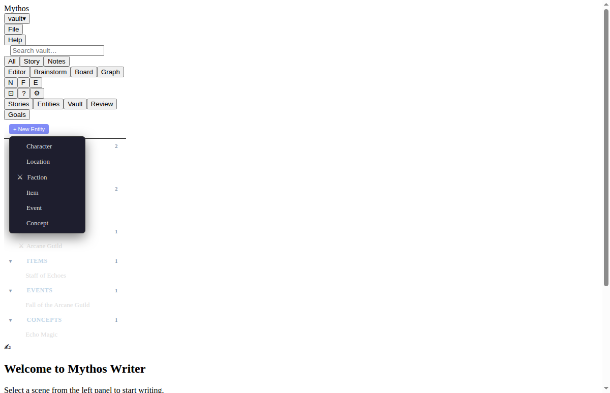
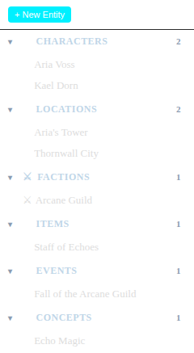
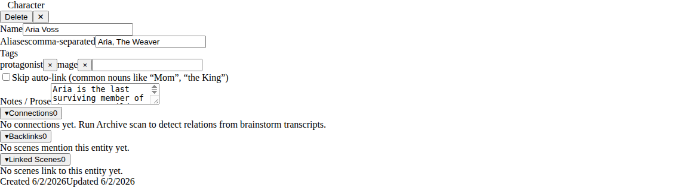
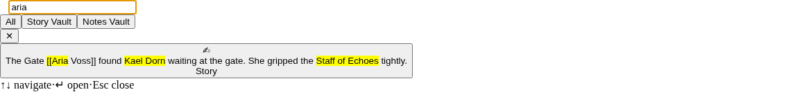

# Entity System — User Guide

Entities are the building blocks of your story world. Mythos Writer lets you
create named characters, locations, items, and more, then link them directly to
scenes in your manuscript. As you write, every `[[Wiki Link]]` you type connects
back to an entity and keeps a live list of the scenes that mention it.

---

## Contents

1. [Entity types](#entity-types)
2. [Creating an entity](#creating-an-entity)
3. [Aliases and tags](#aliases-and-tags)
4. [Mentioning an entity in a scene](#mentioning-an-entity-in-a-scene)
5. [The Entity Browser](#the-entity-browser)
6. [The entity card](#the-entity-card)
7. [Searching across entities](#searching-across-entities)

---

## Entity types

Mythos Writer organises entities into seven types. Pick the type that best fits
the role an entry plays in your story — the Entity Browser groups entries by
type so you can browse them at a glance.

| Type | Icon | Use for |
|------|------|---------|
| **Character** | 👤 | Named persons — protagonists, antagonists, supporting cast |
| **Location** | 📍 | Places — cities, buildings, rooms, landscapes |
| **Faction** | ⚔️ | Groups, organisations, guilds, political bodies |
| **Item** | 💎 | Objects of significance — artefacts, weapons, heirlooms |
| **Event** | 📅 | Historical moments, battles, ceremonies, turning points |
| **Concept** | 💡 | Ideas, themes, magic systems, in-world abstractions |
| **Other** | 📄 | Anything that doesn't fit the above categories |

Entities are stored as plain Markdown files inside your vault at
`entities/<type>s/<id>.md`, so they are readable and editable outside the app.

---

## Creating an entity

You can create entities manually at any time, or let the Brainstorm AI extract
them automatically from a conversation (see [Brainstorm AI](../user-guide.md#brainstorm-ai)).

**To create an entity manually:**

1. In the left rail, click the **Entities** tab.
2. Click **+ New Entity** at the top of the panel.
3. A type picker appears — choose the type that best fits the entry
   (Character / Location / Faction / Item / Event / Concept).
4. The entity is created immediately with a default name ("New Character", etc.)
   and its card opens so you can rename it and fill in aliases, tags, and notes.



> **Tip:** You can also create entities from the Brainstorm panel. When the AI
> mentions a named character, location, or item, Mythos Writer extracts it
> automatically and adds it to the **Entities** tab.

---

## Aliases and tags

**Aliases** are alternate names for the same entity. For example, a character
named "Aria Voss" might also be called "Aria" or "The Weaver" in your manuscript.
Adding these as aliases means wiki-links typed as `[[Aria]]` or
`[[The Weaver]]` resolve to the same entity in the Graph view and backlink list.

Enter aliases in the **Aliases** field, separated by commas:

```
Aria, The Weaver
```

**Tags** are free-form labels you define yourself. Use them to group entities
across types — for example:

```
protagonist, mage, faction:arcane-guild
```

Tags currently serve as a reference layer on the entity card. Future releases
will allow filtering the Entity Browser by tag.

---

## Mentioning an entity in a scene

Type `[[` anywhere in the scene editor to start a wiki-link. A hint tooltip
appears showing matching entities as you type the name.

![Scene editor with [[Kael typed and wiki-link autocomplete hint visible, showing the editor with existing [[...]] links in the scene text](screenshots/entity-04-wikilink-autocomplete.png)

- **Press Enter** or **click** a suggestion to insert the link.
- **Press Escape** to dismiss the hint and type the text literally.

The inserted link is highlighted in the editor:

```
…She found [[Aria Voss]] waiting at the gate…
```

When you click through to the entity card, the **Backlinks** section lists every
scene where that entity is mentioned. Renaming an entity does *not*
automatically update existing `[[...]]` links in scenes — update them manually
if you rename an entity after linking.

### WikiLinks work for notes too

The same `[[...]]` syntax works in the Notes Vault. Links in notes also appear
in the entity's backlink list, so you can link research notes and world-building
files to the same entity as your scenes.

---

## The Entity Browser

The **Entity Browser** lives in the left rail under the **Entities** tab. It
shows all entities in your vault grouped by type.



### Navigating the tree

- **Click a group header** (e.g. *👤 Characters*) to collapse or expand that
  type group. The count badge on each header shows how many entities exist in
  that group.
- **Click an entity name** to open its card in the main panel.
- The currently-selected entity is highlighted in the list.

### Deleting an entity

To delete an entity from the browser:

1. Hover over the entity row — a **×** button appears on the right.
2. Click **×**. A confirmation prompt replaces it with **Delete** / **Cancel**.
3. Click **Delete** to confirm. The entity file is removed from the vault.

> **Caution:** Deleting an entity does not remove `[[...]]` links that reference
> it from scenes. Those links will no longer resolve in the Graph view.

---

## The entity card

Click any entity in the Browser to open its card. The card has three sections:
the **header**, the **edit fields**, and the **Backlinks panel**.



### Editing an entity

All fields on the card are editable:

| Field | Description |
|-------|-------------|
| **Name** | The canonical name used in wiki-links |
| **Aliases** | Comma-separated alternate names |
| **Tags** | Comma-separated labels |
| **Notes / Prose** | Free-form Markdown text — backstory, description, notes |

A **Save** button appears in the header as soon as you change any field. Click
it to write the changes back to the vault file. Click the **✕** button to close
the card — unsaved edits will be lost.

### Connections

The **Connections** section (collapsible) shows typed relationships between this
entity and other entities — for example: *allied with*, *enemy of*, *created by*.
Connections are detected automatically by the Archive agent when it scans
brainstorm transcripts, or set manually via the entity's vault file.

Each connection shows:
- The **relationship type** (e.g. "allied with", "mentor of")
- The **target entity name** — click it to jump to that entity's card

If the panel is empty, run an Archive scan: the Archive agent reads your
brainstorm history and extracts entity relationships automatically.

*Connections are detected by the Archive agent from brainstorm transcripts. The panel shows "No connections yet" when no relations have been extracted.*

### Backlinks

The **Backlinks** section (collapsible) lists every scene and note that contains
a `[[Entity Name]]` link to this entity. Each entry shows:

- The **scene title** — click it to jump to that scene in the editor.
- A short **snippet** of the surrounding text for context.

Backlinks update automatically when you save a scene; you do not need to refresh
the card manually.

*Backlinks populate as you add `[[Entity Name]]` links in your scenes. The panel shows "No scenes mention this entity yet" when no links exist.*

### Deleting from the card

Click the **Delete** button in the card header, then **Confirm delete** to
permanently remove the entity. This is the same action as deleting from the
Browser.

---

## Searching across entities

The global search panel finds entities and scenes in a single query.

**To open global search:** press `Ctrl+K` (Windows/Linux) or `Cmd+K` (macOS),
or click the search icon in the top bar.



### Scope toggles

| Scope | What is searched |
|-------|-----------------|
| **All** | Every scene, note, and entity in the vault |
| **Story Vault** | Scenes only (manuscript) |
| **Notes Vault** | Notes files only |

Entity results appear alongside scene results in the same list, distinguished
by their type icon (👤 / 📍 / 💎 / 💡 / 📄).

### Search tips

- Search is **full-text** — it matches words inside entity notes/prose and scene
  content, not just names.
- Results are **debounced** — the list updates 300 ms after you stop typing.
- Up to 20 results are shown. For large vaults, use the Entity Browser directly
  to browse by type.

---

## Where entities live on disk

Each entity is stored as a Markdown file with YAML frontmatter:

```
vault/
  entities/
    characters/   ← one .md file per character
    locations/
    factions/
    items/
    events/
    concepts/
    others/
```

Example file (`entities/characters/<id>.md`):

```markdown
---
id: abc-123
name: Aria Voss
type: character
aliases:
  - Aria
  - The Weaver
tags:
  - protagonist
  - mage
relations:
  - type: allied with
    target: kael-dorn-id
  - type: enemy of
    target: hollow-king-id
createdAt: 2025-01-01T00:00:00Z
updatedAt: 2025-06-01T12:00:00Z
---

Aria is the last surviving member of the Arcane Guild.
She carries the Staff of Echoes and speaks in riddles.
```

Because these are plain Markdown files, you can edit them in any text editor,
back them up with your normal file-backup workflow, or version-control the vault
folder with Git.

---

*Next: [Keyboard shortcuts](../keyboard-shortcuts.md) · Back: [User Guide index](../user-guide.md)*
