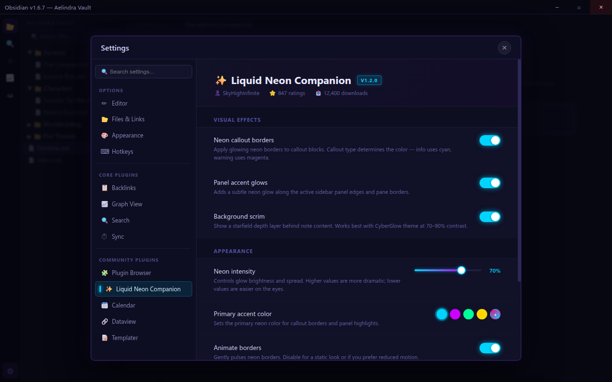
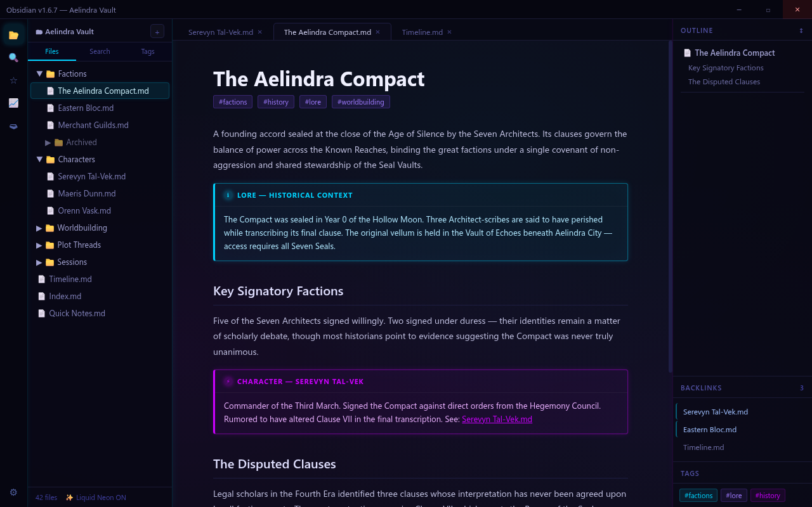
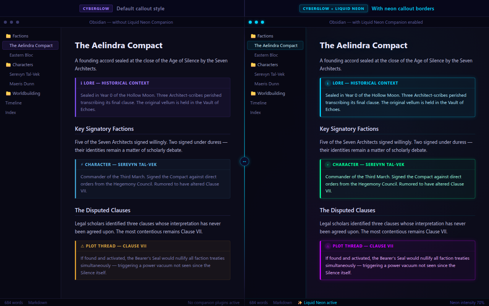

# Liquid Neon Companion

> The missing half of your CyberGlow theme.

CyberGlow gives you the dark cyberpunk foundation. **Liquid Neon Companion** fills in the rest — extending callouts, buttons, panel accents, kanban cards, and UI chrome with the full cyan/magenta glass treatment, so every corner of your vault matches.

---

## What it does

CyberGlow's base theme covers the editor and core sidebars. This plugin adds coordinated CSS overrides for the surfaces that ship unstyled or inconsistent out of the box:

| Surface | What changes |
|---|---|
| **Callouts** | Each type gets a distinct neon-framed frosted-glass panel |
| **Buttons** | Primary, secondary, and danger states in cyan/magenta neon |
| **Panel accents** | Tab bars, modal headers, and settings sections in Liquid Neon glass |
| **Kanban boards** | Card backgrounds, column headers, and drag handles styled to match |
| **Tags** | Inline neon pill badges with per-category tinting |

---

## Prerequisites

| Requirement | Notes |
|---|---|
| **CyberGlow theme** | Must be active. Liquid Neon Companion extends CyberGlow — it does not replace it. |
| Obsidian v1.5.3+ | Tested against current stable release. |

---

## Installation

### Via BRAT (available now)

1. Install [BRAT](https://github.com/TfTHacker/obsidian42-brat) from the Obsidian community directory.
2. Open **BRAT → Add a beta plugin** and paste: `SkyyPlayz/liquid-neon-companion`
3. Enable **Liquid Neon Companion** in **Settings → Community plugins**.

### Via Obsidian community directory *(coming soon)*

Search **"Liquid Neon"** in **Settings → Community plugins → Browse** and install directly once listed.

---

## Screenshots

**Settings panel — Liquid Neon Companion controls inside Obsidian**

**Neon callouts and panel accents active alongside CyberGlow**

**Before / after: CyberGlow alone vs. CyberGlow + Liquid Neon Companion**

---

## Configuration

Liquid Neon Companion activates automatically when enabled alongside CyberGlow — no settings panel required. To adjust glow intensity or contrast, use CyberGlow's built-in **Style Settings** controls.

---

## Theme compatibility

| Theme | Support |
|---|---|
| CyberGlow | ✅ Fully supported (required) |
| Other Obsidian themes | ❌ Untested — conflicts likely |

---

## License

MIT © [SkyyPlayz](https://github.com/SkyyPlayz). See [LICENSE](LICENSE) for full terms.

---

## Credits

Built on top of the excellent [CyberGlow](https://github.com/ArtexJay/Obsidian-CyberGlow) theme by ArtexJay.

Liquid Neon is the visual identity of [Mythos Writer](https://github.com/SkyyPlayz/Mythos-Writer) — brought to Obsidian as a companion layer for writers who live in both apps.
